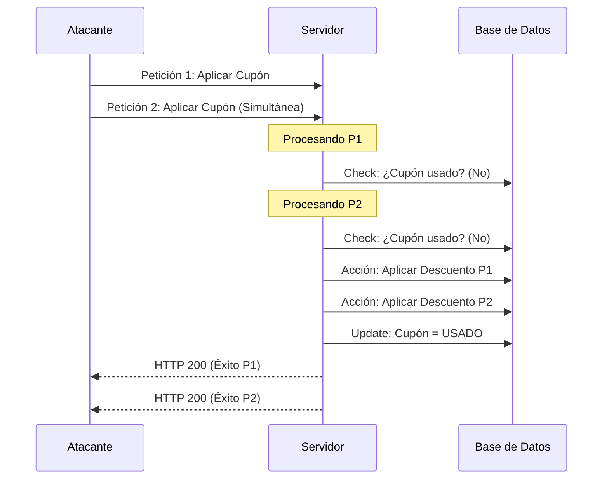

---
Tags: #web #race-condition #concurrency #pentesting #bugbounty #owasp #exploitation #toctou

---
# Índice de Contenidos

#### Introducción
- [[#1. Introducción a las Condiciones de Carrera (Race Conditions)]]
    
- [[#2. Herramientas Clave para la Explotación]]
	
#### Técnicas
- [[#3. Técnica 1: Superando Límites (Limit Overrun) en Lógica de Negocio]]
    
- [[#4. Técnica 2: Bypass de Limitación de Tasa (Rate Limit) vía Race Condition]]
	
- [[#5. Técnica 3: Condiciones de Carrera en Múltiples Endpoints (TOCTOU)]]
    
- [[#6. Técnica 4: Condiciones de Carrera en un Único Endpoint (Account Takeover)]]
    
- [[#7. Técnica 5: Vulnerabilidades Sensibles al Tiempo y Generación de Tokens]]
	
- [[#8. Técnica 6: Ataque de Registro y Confirmación "Nula" (Non-Atomic DB)]]
    
#### CheatSheets y Referencias
- [[#9. Bypass de Estructuras de Datos: Arrays y Valores Nulos]]
    
- [[#10. Resumen de Explotación y Payloads (Cheat Sheet)]]
    - [[#Tabla de Técnicas y Escenarios comunes]]
    - [[#Payloads de Referencia (Inspirado en PayloadsAllTheThings)]]
    
- [[#11. Referencias y Recursos]]
---

## 1. Introducción a las Condiciones de Carrera (Race Conditions)

Las **Condiciones de Carrera (Race Conditions)** ocurren cuando un sistema o aplicación web intenta realizar dos o más operaciones al mismo tiempo (de forma concurrente) sobre un recurso compartido, pero la lógica de la aplicación asume que estas operaciones se ejecutarán de forma secuencial.

**¿Por qué ocurren?** El servidor recibe una petición, verifica una condición (ej. _¿Tiene saldo?_), y luego ejecuta una acción (ej. _Descontar saldo y procesar compra_). Si enviamos múltiples peticiones simultáneas en el breve lapso de tiempo (milisegundos) que hay entre la **verificación** y la **acción**, el servidor procesará la acción múltiples veces basándose en la primera verificación.

---

## 2. Herramientas Clave para la Explotación

Para explotar estas vulnerabilidades, la precisión milimétrica es vital. Las herramientas que has utilizado son el estándar de la industria:

- **Burp Suite Professional (Trigger Race Condition):** Utiliza una técnica avanzada en HTTP/2 llamada _Single-Packet Attack_. Agrupa múltiples peticiones en un solo paquete TCP, lo que garantiza que lleguen y sean procesadas por el servidor de destino en el mismo microsegundo, eliminando la latencia de red (jitter) de la ecuación.
    
- **Burp Suite Community (Repeater Tab Groups):** Aunque no tiene la precisión del ataque de paquete único, permite agrupar varias pestañas (Send group in parallel). Útil para sistemas que tienen ventanas de condición de carrera más amplias.
    
- **Turbo Intruder:** Una extensión de Burp Suite programable en Python. Está diseñada para enviar una cantidad masiva de peticiones a velocidades extremas. Permite crear _gates_ (puertas) que retienen las peticiones construidas y las liberan todas de golpe simultáneamente.
    

---

## 3. Técnica 1: Superando Límites (Limit Overrun) en Lógica de Negocio

### 📖 Concepto

Esta técnica se basa en abusar de una funcionalidad que debería tener un límite de un solo uso (ej. aplicar un cupón de descuento, votar, canjear una tarjeta regalo). El objetivo es forzar al servidor a aplicar el beneficio múltiples veces antes de que actualice el estado en la base de datos (marcando el cupón como "usado").

### 🔍 Cómo Descubrirlo

1. Identifica un endpoint donde ocurra una validación de estado seguida de una acción que modifique el saldo/precio (ej. `/cart/coupon`).
    
2. Aplica la acción de forma normal y observa la respuesta.
    
3. Intenta aplicarlo de nuevo. Si el servidor lo deniega correctamente, el siguiente paso es probar la concurrencia.
    

### 💥 Explotación (PoC: Descuento Múltiple)

En este escenario, el objetivo era comprar una chaqueta de cuero de alto valor superando el crédito disponible, aplicando un mismo código de descuento múltiples veces.

**Metodología:**

1. **Interceptar:** Capturamos la petición que aplica el código de descuento en el carrito.
    
2. **Preparar el Ataque:**
    
    - _Opción Pro:_ Enviamos la petición al Repeater, duplicamos la petición unas 20 veces y usamos la opción **'Send group (parallel) -> Trigger race condition'**.
        
    - _Opción Free:_ Agrupamos varias pestañas con la misma petición de descuento en el Repeater y las enviamos usando **'Send in parallel'**.
        
3. **Resultado:** Varias peticiones reciben un código HTTP 200/302 de éxito, demostrando que el descuento se aplicó concurrentemente bajando el precio del artículo drásticamente.
    
4. **Impacto:** Compra de artículos costosos sin el crédito suficiente.
    

### 📊 Flujo Lógico: Limit Overrun (Técnica 1)



---

## 4. Técnica 2: Bypass de Limitación de Tasa (Rate Limit) vía Race Condition

### 📖 Concepto

Los mecanismos de Rate Limiting y bloqueos de cuenta (Account Lockout) evitan ataques de fuerza bruta bloqueando la IP o el usuario tras `X` intentos fallidos. Sin embargo, si enviamos múltiples intentos de inicio de sesión _exactamente_ al mismo tiempo, el contador de intentos fallidos del servidor no se actualiza lo suficientemente rápido para bloquear la ráfaga inicial.

### 🔍 Cómo Descubrirlo

1. Realiza intentos fallidos intencionales para entender cómo y cuándo actúa el bloqueo (ej. _Bloqueo por 1 minuto tras 3 intentos_).
    
2. Si mandas ráfagas simultáneas y el servidor procesa más peticiones de las permitidas antes de lanzar el bloqueo, es vulnerable.
    

### 💥 Explotación (PoC: Fuerza Bruta con Turbo Intruder)

En este escenario, el servidor bloqueaba los intentos tras unos pocos fallos. Para realizar un ataque de fuerza bruta exitoso, disparamos una lista completa de contraseñas de golpe usando **Turbo Intruder**.

**Script Utilizado (Turbo Intruder):**

```Python
def queueRequests(target, wordlists):
    # Configuramos el motor para usar HTTP/2 y Single-Packet Attack (Engine.BURP2)
    engine = RequestEngine(endpoint=target.endpoint,
                           concurrentConnections=1,
                           engine=Engine.BURP2 
                           )

    # Iteramos sobre una lista de contraseñas copiadas en el portapapeles
    for password in wordlists.clipboard:
        # Añadimos las peticiones a la "puerta" o "gate" llamada 'race1'.
        # El segundo argumento (password.strip()) reemplaza el '%s' en la petición cruda de Burp.
        engine.queue(target.req, password.strip(), gate='race1')

    # Liberamos todas las peticiones sincronizadas al mismo tiempo
    engine.openGate('race1')

def handleResponse(req, interesting):
    table.add(req)
```

**Análisis del Script:**

- El uso de `Engine.BURP2` es crucial, ya que agrupa todas las peticiones envenenadas (cada una con un payload diferente en `%s`) en el mismo paquete de red.
    
- Al hacer `engine.openGate('race1')`, el servidor recibe la lista entera de contraseñas _antes_ de que su lógica interna pueda decir: _"Espera, este usuario ya ha fallado 3 veces, bloquéalo"_. Alguna de esas peticiones procesadas simultáneamente acertará la contraseña.

---
## 5. Técnica 3: Condiciones de Carrera en Múltiples Endpoints (TOCTOU)

### 📖 Concepto

Esta técnica explota lo que en ciberseguridad conocemos como **TOCTOU (Time-of-Check to Time-of-Use)**. Ocurre cuando interactuamos con dos endpoints diferentes de forma simultánea para provocar una inconsistencia en la lógica de negocio. El servidor verifica una condición (Check), pero antes de que utilice ese dato (Use), nosotros alteramos el estado del sistema a través de otro endpoint.

### 🔍 Cómo Descubrirlo (Análisis de Tiempos)

El secreto aquí está en medir la latencia de cada endpoint. Si una acción crítica es más rápida que una acción preparatoria, podemos intercalarlas.

|**Endpoint**|**Acción**|**Tiempo de Respuesta**|**Observación Estratégica**|
|---|---|---|---|
|`POST /cart`|Añadir producto|**400 ms**|Tarda mucho. Petición "lenta".|
|`POST /checkout`|Pagar / Validar saldo|**50 ms**|Muy rápida. Petición "rápida".|

### 💥 Explotación (PoC: Compra con Desfase)

El objetivo es insertar un producto costoso en el carrito en la ventana de tiempo exacta en que el servidor valida nuestro saldo, pero _antes_ de que confirme la compra y reste el crédito.

**Metodología:**

1. Iniciamos la petición al endpoint `/checkout` (rápida). El servidor verifica que tenemos saldo para el carrito actual (ej. vacío o con un ítem barato) y da luz verde.
    
2. Inmediatamente, enviamos la petición al endpoint `/cart` (lenta) para añadir el artículo caro.
    
3. Debido al desfase, el producto caro entra al carrito _después_ de la validación de crédito (Check), pero _antes_ de que la base de datos cierre la orden de compra (Use).
    
4. **Resultado:** Adquirimos un artículo caro pagando un precio muy inferior o superando nuestro límite de crédito.
    

### 📊 Flujo Lógico: Múltiples Endpoints / TOCTOU (Técnica 3)

Aquí visualizamos el "desfase" de milisegundos que mencionabas en tus notas:

| **Tiempo**    | **Acción del Atacante**  | **Estado del Proceso** | **Validación del Servidor**                 |
| ------------- | ------------------------ | ---------------------- | ------------------------------------------- |
| **0ms**       | `POST /checkout`         | **Inicio Pago**        | "¿Tiene saldo para 0€?" -> **SÍ**           |
| **150ms**     | `POST /cart` (ítem caro) | **Añadiendo...**       | (El servidor sigue procesando el pago)      |
| **300ms**     | (Latencia de red)        | **Ítem añadido**       | Carrito actualizado a 1000€                 |
| **400ms**     | `POST /checkout`         | **Finalizando**        | Ejecuta cobro de la validación inicial (0€) |
| **Resultado** | **Compra Éxito**         | **¡Robo logrado!**     | Has comprado el ítem de 1000€ por 0€        |

---

## 6. Técnica 4: Condiciones de Carrera en un Único Endpoint (Account Takeover)

### 📖 Concepto

A veces, un solo endpoint que gestiona un proceso de múltiples pasos (ej. actualizar email -> guardar en BD -> generar token -> enviar correo) sufre micro-desincronizaciones. Si enviamos peticiones paralelas con datos distintos, las variables internas del servidor pueden sobrescribirse a mitad del proceso.

### 🔍 Cómo Descubrirlo

Busca endpoints que realicen actualizaciones de estado de usuario (cambios de email, contraseñas, roles) que requieran una confirmación posterior. Envía dos peticiones concurrentes con parámetros diferentes y analiza si el comportamiento devuelto mezcla datos de ambas.

### 💥 Explotación (PoC: Secuestro de Cuenta de Administrador)

El objetivo es forzar que el sistema genere un enlace de confirmación de correo electrónico que se envíe a nuestro correo, pero que en la base de datos esté asociado al correo de la víctima (`carlos@ginandjuice.shop`).

**Metodología:**

1. Diseñamos dos peticiones paralelas en Burp Suite:
    
    - _Petición A:_ Cambiar email a `atacante@mi-dominio.com`
        
    - _Petición B:_ Cambiar email a `carlos@ginandjuice.shop`
        
2. Las enviamos sincronizadas (Single-Packet Attack o Parallel Group).
    
3. **La colisión:** En el servidor, la Petición B actualiza el correo pendiente a _Carlos_. Una fracción de milisegundo después, la Petición A entra y el servidor usa _nuestro_ correo para generar el destino del mensaje SMTP, pero incluye el token recién creado que la base de datos asoció a _Carlos_.
    
4. **Resultado:** Recibimos el enlace de confirmación en nuestra bandeja. Al hacer clic, el sistema valida `carlos@ginandjuice.shop` en nuestra sesión.
    
5. **Impacto:** Escalada de privilegios. Al ser reconocidos como Carlos (Admin), accedemos al panel y lo eliminamos.
    

---

## 7. Técnica 5: Vulnerabilidades Sensibles al Tiempo y Generación de Tokens

### 📖 Concepto

Aunque no es una "condición de carrera" de estados compartidos en el sentido estricto, la concurrencia se utiliza para explotar **Inseguridad Criptográfica / Entropía Débil**. Si un servidor genera tokens de recuperación basándose en la marca de tiempo (timestamp) en lugar de usar números aleatorios seguros, dos peticiones que lleguen en el mismo milisegundo generarán _el mismo token_.

### 🔍 Cómo Descubrirlo

1. Solicita varios tokens de reseteo de contraseña lo más rápido posible.
    
2. Compara los tokens generados. Si son idénticos o tienen un patrón muy predecible, el sistema es vulnerable.
    
3. Verifica si el token está _criptográficamente ligado_ al usuario. Si el token sirve para cualquier usuario, tenemos una brecha crítica.
    

### 💥 Explotación (PoC: Robo de Token de Reseteo)

Descubrimos que los tokens se basan en la hora exacta y no incluyen el nombre de usuario de forma inmutable.

**Peticiones en Paralelo:**

Enviamos estas dos peticiones exactamente al mismo tiempo usando Burp:

_Petición 1 (Atacante - wiener):_

```HTTP
POST /forgot-password HTTP/2
Host: 0a69...web-security-academy.net
Cookie: phpsessionid=NGdY...

csrf=KhXR...&username=wiener
```

_Petición 2 (Víctima - carlos):_

```HTTP
POST /forgot-password HTTP/2
Host: 0a69...web-security-academy.net
Cookie: phpsessionid=NGdY...

csrf=KhXR...&username=carlos
```

**La Ejecución:**

Al alinearse los tiempos de respuesta, el servidor genera el mismo token para ambos.

Nosotros recibimos el correo legítimo para `wiener` con la siguiente URL:

`https://0a69...net/forgot-password?user=wiener&token=9f13c8c1ee59...`

**Bypass Final:**

Como sabemos que el token `9f13c8c...` también se le asignó a Carlos, simplemente alteramos el parámetro `user` en nuestra URL válida:

`https://0a69...net/forgot-password?user=carlos&token=9f13c8c1ee59...`

_¡Bingo! Establecemos una nueva contraseña para la cuenta de Carlos._

---
## 8. Técnica 6: Ataque de Registro y Confirmación "Nula" (Non-Atomic DB)

### 📖 Concepto: La Brecha de Atomicidad

El fallo ocurre porque el servidor no es **atómico** al crear un usuario. En base de datos, una operación atómica es "todo o nada". Aquí, el servidor realiza dos pasos con un micro-retraso entre ellos:

1. **Paso A:** Inserta el nuevo usuario en la DB (el campo `token` se inicializa como `NULL` o vacío).
    
2. **Paso B:** Genera el token real, lo guarda en la DB y lo envía por correo.
    

### 💥 Explotación (The Single-Packet Attack)

Si enviamos una petición de confirmación con un valor nulo (`token[]=`) justo en el milisegundo intermedio entre el Paso A y el Paso B, el servidor comparará nuestra entrada con el valor `NULL` que aún reside en la base de datos. Al coincidir, valida la cuenta.

**Análisis del Script de Turbo Intruder:**

Este script es una obra maestra de la sincronización. Usa una ráfaga para intentar "caer" en el hueco temporal.

```Python
def queueRequests(target, wordlists):
    engine = RequestEngine(endpoint=target.endpoint,
                            concurrentConnections=1,
                            engine=Engine.BURP2 # Vital para Single-Packet Attack
                            )
    
    # Preparamos la petición de confirmación con el bypass de array vacío
    confirmationReq = '''POST /confirm?token[]= HTTP/2
Host: [TARGET_HOST]
Cookie: phpsessionid=[ID]
Content-Length: 0

'''
    for attempt in range(100): # Hacemos 100 intentos de carrera
        currentAttempt = str(attempt)
        username = 'Mellam3' + currentAttempt
        email = "l3" + currentAttempt + "@ginandjuice.shop"
        
        # 1. Encolamos la petición de REGISTRO
        engine.queue(target.req, [username, email], gate=currentAttempt)
        
        # 2. Inundamos con 800 peticiones de CONFIRMACIÓN nula
        for i in range(800):
            engine.queue(confirmationReq, gate=currentAttempt)
        
        # 3. Disparamos el GATE: El registro y las 800 confirmaciones salen pegadas
        engine.openGate(currentAttempt)
```

---

## 9. Bypass de Estructuras de Datos: Arrays y Valores Nulos

Para que el ataque anterior funcione, necesitamos que el servidor compare "nada" con "nada". Muchos frameworks permiten enviar arrays o valores nulos mediante sintaxis no estándar en los parámetros.

|**Lenguaje / Framework**|**Sintaxis de Bypass**|**Interpretación del Servidor**|
|---|---|---|
|**PHP**|`token[]=`|`token = array()` (Array vacío)|
|**PHP**|`token[]=foo&token[]=bar`|`token = ['foo', 'bar']`|
|**Ruby on Rails**|`user[token]` (sin valor)|`params = {"user"=>{"token"=>nil}}`|
|**Python/Flask**|`token=`|Depende del parser, a menudo `""` o `None`|

---

## 10. Resumen de Explotación y Payloads (Cheat Sheet)

### Tabla de Técnicas y Escenarios comunes

|**Escenario**|**Objetivo**|**Técnica Sugerida**|**Herramienta**|
|---|---|---|---|
|**E-commerce / Cupones**|Compras gratis / Descuentos|Limit Overrun|Burp Repeater (Parallel)|
|**Login / 2FA**|Fuerza Bruta sin bloqueo|Rate Limit Bypass|Turbo Intruder (Gate)|
|**Cambio de Email**|Account Takeover (ATO)|Multi-endpoint Race|Burp Repeater (Group)|
|**Password Reset**|Predecir tokens|Time-sensitive Attack|Turbo Intruder / Repeater|
|**Registros / Validaciones**|Bypass de activación|Non-atomic Null Attack|Turbo Intruder + Array Bypass|

### Payloads de Referencia (Inspirado en PayloadsAllTheThings)

- **Para Arrays (PHP):** `?id[]=1&id[]=2`
    
- **Para Multi-param:** `?email=victim@target.com&email=attacker@evil.com`
    
- **JSON Race:** `{"email": ["victim@t.com", "attacker@e.com"]}` (Si el parser JSON es débil).
    

---

## 11. Referencias y Recursos

Para profundizar en la investigación de estas vulnerabilidades y estar al día con las últimas PoC, consulta los siguientes repositorios:

- **PortSwigger Academy:** [Race Conditions Research](https://portswigger.net/web-security/race-conditions)
    
- **PayloadsAllTheThings:** [Race Condition Section](https://github.com/swisskyrepo/PayloadsAllTheThings/tree/master/Race%20Condition)
    
- **James Kettle (alchemistowl):** El creador de Turbo Intruder y la técnica de _Single-Packet Attack_.